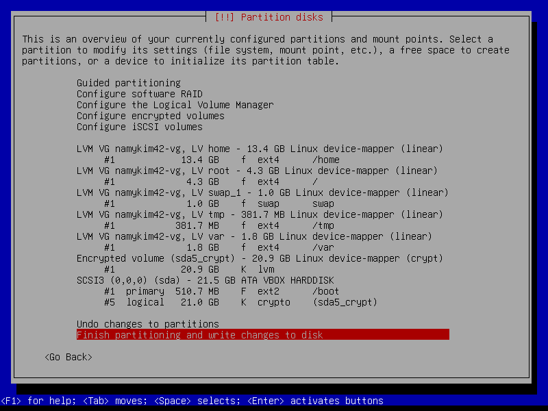

이 화면을 보면서 파티셔닝이 필수다보니 파티셔닝을 진행중이었는데 막혔다. 

```md
### 파티셔닝

LVM을 사용하여 최소 2개의 암호화된 파티션을 생성해야 합니다. 다음은 가능한 파티셔닝의 예입니다:

bash
wil@wil:~$ lsblk
NAME                MAJ:MIN RM SIZE RO TYPE MOUNTPOINT
sda                 8:0    0   8G  0 disk
├─sda1              8:1    0  487M 0 part /boot
├─sda2              8:2    0   1K  0 part
└─sda5              8:5    0  7.5G 0 part
  └─sda5_crypt      254:0  0  7.5G 0 crypt
    ├─wil--vg-root  254:1  0  2.8G 0 lvm  /
    ├─wil--vg-swap_1 254:2  0  976M 0 lvm  [SWAP]
    └─wil--vg-home  254:3  0  3.8G 0 lvm  /home
sr0                 11:0   1 1024M 0 rom
wil@wil:~$ _
```

이런식인데

각 용어 정립이 안되었다. 

-> 이때 필요한게 linux 저장 장치 계층 구조 (5층)

- Layer 5. 파일시스템 + 마운트 포인트(ext4, ext2, swap)(/boot, /, /home, /var...)
- Layer 4. LVM — 논리 볼륨 (LV, VG, PV)
- Layer 3. LUKS 암호화 (sda5_crypt)
- Layer 2. 파티션 테이블 (sda1, sda5)
- Layer 1. 물리 블록 디바이스(sda — 21.5 GB 디스크 한 장)

# 리눅스 파티셔닝에 나오는 모든 용어와 개념 born2beroot 스럽게 파헤치기

## 리눅스 저장 장치 5계층

### Layer1 : 물리 디스크

1. SCSI: 
	["Scuzzy" SCSI Small Computer System Interface Small Computer System Interface (SCSI, /ˈskʌzi/ SKUZ-ee) is a set of standards for physically connecting and transferring data between computers and peripheral devices, best known for its use with storage devices such as hard disk drives](https://en.wikipedia.org/wiki/SCSI)
	[SCSI(스커지/스카시,[2] Small Computer System Interface, 문화어: 스카지, 소형 컴퓨터 체계 대면부, 컴퓨터 체계 결합장치)는 컴퓨터와 주변기기 사이에서 물리적으로 연결하고 데이터를 전송하기 위한 표준 세트이며, 하드 디스크 드라이브와 같은 저장 장치에 사용되는 것으로 가장 잘 알려져 있다.](https://ko.wikipedia.org/wiki/SCSI)

2. sd 란?:
	[sd](https://manpages.ubuntu.com/manpages/noble/ko/man4/sd.4.html)
	[The  block device name has the following form: sdlp, where l is a letter denoting the physical drive, and p is a number denoting the partition on that physical drive.](https://manpages.ubuntu.com/manpages/noble/ko/man4/sd.4.html)
	[파티션 0은 모든 드라이브이다. 파티션 1에서 4는 도스"프라이머리"파티션이다.파티션 5에서 8은 도스 "확장(혹은 "논리")" 파티션이다.](https://manpages.ubuntu.com/manpages/noble/ko/man4/sd.4.html)

3. libata란? :
	[libATA is a library used inside the Linux kernel to support ATA host controllers and devices.](https://en.wikipedia.org/wiki/LibATA)

4. ATA란? :
	[병렬 ATA(Parallel ATA, PATA, 파타, 원래 명창: AT Attachment, 고급 기술 결합/Advanced Technology Attachment, ATA, Integrated Drive Electronics, IDE)는 IBM PC 호환 기종을 위해 설계된 표준 인터페이스이다. ](https://ko.wikipedia.org/wiki/%EB%B3%91%EB%A0%AC_ATA)

	[2003년 최신 직렬 ATA (SATA)가 도입되었을 때, 원래의 ATA는 병렬 ATA 또는 약칭으로 PATA로 이름이 변경되었다.[15]](https://ko.wikipedia.org/wiki/%EB%B3%91%EB%A0%AC_ATA)

5. SATA란? : 
	[직렬 ATA(Serial ATA, SATA)는 하드 디스크 혹은 광학 드라이브와 데이터 전송을 주요 목적으로 만든 컴퓨터 버스의 한 가지이다. 약자를 철자대로 읽어서 사타(영어식으로는 새터, 세이터)라고도 한다. 직렬 ATA는 예전의 ATA 표준을 계승하여, ‘병렬 ATA(PATA, Parallel ATA, 기존의 ATA)’를 대체하기 위해 고안되었다. 직렬 ATA 어댑터와 장치들은 비교적 속도가 빠른 직렬 연결을 이용하여 연결된다.](https://ko.wikipedia.org/wiki/%EC%A7%81%EB%A0%AC_ATA)

6. SATA가 왜 더 PATA 보다 빠를까?:
	[In short, SATA transfers all data through a single pair of wires (one of which carries the same data as the first but with inverted polarity.), whereas PATA transfers multiple bits of data on different wires at the same time. As the transfer rate grows, even small differences in the lengths of the individual wires can result in differences in the arrival time of bits on adjacent wires to a degree that jeopardizes the integrity of the transfer.By sending all bits down the same wire, there is no possibility of skew in the signals, the receiver just needs to be able to distinguish the time period of the bits coming down that one pair. Even though this means that the base clock needs to run at least 8x faster than PATA to transfer a single one byte, in practice it can go far faster than that and has exceeded PATA’s maximum transfer rates by orders of magnitude at this point.](https://www.quora.com/Why-is-SATA-faster-than-PATA)

7. SCSI3 (0,0,0) 각각의 의미는?:

	- `SCSI3` = partman이 kernel의 host 번호를 **1-based**로 변환한 값.
	  kernel 내부는 0-based: host0, host1, host2 → partman 표시: SCSI1, SCSI2, SCSI3
	  우리 디스크(sda)는 host2(0-based) = **SCSI3(1-based)**
	  실증: [`scsi 2:0:0:0: Direct-Access ATA VBOX HARDDISK`](VirtualBox_c2r5s2ext4_15_04_2026_16_52_28.png) → `sd 2:0:0:0: [sda]`

	- `(0,0,0)` = SCSI 주소 중 host를 제외한 나머지 **(Channel=0, Target=0, LUN=0)**
	  전체 HCTL 표기: `scsi 2:0:0:0` → host=2, channel=0, target=0, lun=0
	  이 디스크가 SATA 컨트롤러의 유일한 장치이므로 전부 0
	  출처: [scsi_add_device(host, channel, target, lun) — Linux kernel SCSI 주소 체계](https://www.kernel.org/doc/html/latest/driver-api/libata.html)

8. SCSI host 탐지 순서와 장치 번호 부여 규칙 (실측 dmesg 기반):

	실제 dmesg 로그 ([스크린샷](VirtualBox_c2r5s2ext4_15_04_2026_16_51_08.png)):
	```
	scsi host0: ata_piix   → ata1 (PATA) → 연결된 장치 없음 (빈 컨트롤러, 탐지 실패 아님)
	scsi host1: ata_piix   → ata2 (PATA) → CD-ROM → sr0
	scsi host2: ahci       → ata3 (SATA) → HARDDISK → sda
	```

	규칙 1 — **SCSI host 번호 (partman)**:
	kernel host 번호(0-based) + 1 = partman의 SCSI 번호(1-based)
	host0→SCSI1, host1→SCSI2, host2→**SCSI3**

	규칙 2 — **sd 번호 (disk)**:
	전체 시스템에서 감지된 disk(하드디스크/SSD) 순서대로 a, b, c...
	host 번호와 무관. 첫 disk=sda, 두 번째=sdb
	출처: [`sdlp where l is a letter denoting the physical drive`](https://manpages.ubuntu.com/manpages/noble/ko/man4/sd.4.html)

	규칙 3 — **sr 번호 (optical)**:
	전체 시스템에서 감지된 optical drive 순서대로 0, 1, 2...
	host 번호와 무관. 첫 CD-ROM=sr0, 두 번째=sr1
	실증: [`sr 1:0:0:0: [sr0] scsi3-mmc drive`](VirtualBox_c2r5s2ext4_15_04_2026_16_51_08.png)

	가상 시나리오 (규칙 검증):
	| host (0-based) | partman (1-based) | 장치 | 번호 |
	|---|---|---|---|
	| host0 | SCSI1 | (없음) | — |
	| host1 | SCSI2 | CD-ROM #1 | sr0 |
	| host2 | SCSI3 | disk #1 | sda |
	| host3 (가상) | SCSI4 | CD-ROM #2 | sr1 |
	| host4 (가상) | SCSI5 | disk #2 | sdb |

9. block device란? 
	[블록 특수 파일(block special file) 또는 블록 장치(block device)는 버퍼링된 접근을 하드웨어 장치에 제공하며, 이들의 세부 사항에 따라 어느 정도의 추상화를 제공한다.](https://ko.wikipedia.org/wiki/%EC%9E%A5%EC%B9%98_%ED%8C%8C%EC%9D%BC#%EB%B8%94%EB%A1%9D_%EC%9E%A5%EC%B9%98)

	[Block Device란 파일 시스템에서 블럭 단위로 정보가 오고가는 시스템을 말한다. 옜날에는 한 블럭의 단위가 보통 512바이트 였으나, 요즘 세대에서는 한 페이지의 크기와 같은 4096바이트를 기본으로 사용하고 있다. 이러한 블럭 디바이스는 주로 Storage를 구현하기 위해서 사용되며, buffer stream과 같은 장치에 의해서 캐싱되었다가 한번에 여러 블럭을 작성하는 등의 optimization을 거의 필수적으로 사용하게 된다.](https://junhoahn.kr/noriwiki/index.php?title=Block_device)

10. character device?
	[문자 특수 장치(character special file) 또는 문자 장치(character device)는 버퍼링되지 않은, 직접 접근을 하드웨어 장치에 제공한다.](https://ko.wikipedia.org/wiki/%EC%9E%A5%EC%B9%98_%ED%8C%8C%EC%9D%BC#%EB%AC%B8%EC%9E%90_%EC%9E%A5%EC%B9%98)

	[예를 들어서 키보드나 마우스의 경우, 블락단위로 장치에 정보가 오고가는 것이 아니라 장치에 대한 응답이 바이트 단위로 작성되게 된다. 이러한 장치들을 캐릭터 디바이스의 범주에서 묶어서 처리한다. 캐릭터 디바이스는 주로 Storage장치가 아닌 시스템에 대한 I/O를 처리하기 위해서 사용된다.](https://junhoahn.kr/noriwiki/index.php/Character_device)

11. device file?
	[In Unix-like operating systems, a device file, device node, or special file is an interface to a device driver that appears in a file system as if it were an ordinary file.](https://en.wikipedia.org/wiki/Device_file)

	[/dev 디렉토리를 확인해보자.](https://jmiry.github.io/2019/05/07/device_file.html)

12. /dev 디렉토리
	위에서 봤듯이 사실 리눅스에서는 모든게 파일이다. 따라서 디바이스 연결또한 파일로 관리하려한다. 실제로 그렇다. 그리고 그게 저장되어있는 디렉토리가 /dev
	마우스 클릭을 받을때도 open mouse, read mouse, 마우스 연결을 끊을때도 write mouse "", close mouse 이런식이다. 

13. /dev에서 뭘로 어떻게 구별해서 알잘딱 사용하는가?
	규칙이 있겠지
	brw-rw----   1 root disk        8,     0  4월 15 15:05 sda
	맨앞에 b==blockdevice
	8 == 저장장치의 메이저번호
	0 == 마이너번호는 그룹상 몇번째인지를 의미 아래는 다른 예시
	brw-rw----   1 root disk        8,    16  4월 15 15:06 sdb
	brw-rw----   1 root disk        8,    17  4월 15 15:06 sdb1
	brw-rw----   1 root disk        8,    18  4월 15 15:06 sdb2
	보면 파티션이 나눠져서 그런지 마이너 번호가 다르다.
	c2r1s1% ls -l /dev/input
	crw-rw---- 1 root input 13, 63  3월 30 18:51 mice
	마우스는 역시나 캐릭터디바이스가 맞고 메이저 13이다.사실 input device로 분류된 아가들은 전부 13이다.
	[머리가 어질어질하지만 찾은 것 중에서는 가장 가독성 좋은 총망라](https://medium.com/@linuxrootroom/major-and-minor-numbers-in-linux-kernel-0c54af7a0ab8#id_token=eyJhbGciOiJSUzI1NiIsImtpZCI6ImIzZDk1Yjk1ZmE0OGQxODBiODVmZmU4MDgyZmNmYTIxNzRiMDQ2NjciLCJ0eXAiOiJKV1QifQ.eyJpc3MiOiJodHRwczovL2FjY291bnRzLmdvb2dsZS5jb20iLCJhenAiOiIyMTYyOTYwMzU4MzQtazFrNnFlMDYwczJ0cDJhMmphbTRsamRjbXMwMHN0dGcuYXBwcy5nb29nbGV1c2VyY29udGVudC5jb20iLCJhdWQiOiIyMTYyOTYwMzU4MzQtazFrNnFlMDYwczJ0cDJhMmphbTRsamRjbXMwMHN0dGcuYXBwcy5nb29nbGV1c2VyY29udGVudC5jb20iLCJzdWIiOiIxMDgyMzE3NTY5Mjg2OTc0NjAwMDAiLCJlbWFpbCI6ImRvbmdqaTE1NzhAZ21haWwuY29tIiwiZW1haWxfdmVyaWZpZWQiOnRydWUsIm5vbmNlIjoibm90X3Byb3ZpZGVkIiwibmJmIjoxNzc2MjQyMzQ1LCJuYW1lIjoiTm9lbCIsInBpY3R1cmUiOiJodHRwczovL2xoMy5nb29nbGV1c2VyY29udGVudC5jb20vYS9BQ2c4b2NJSmtTRV9zNGFsMEZZd2NSN0VKVWVyRDhVMGQ2Sl94b3VuZ1lfM2lvOG5RN2lWSlE9czk2LWMiLCJnaXZlbl9uYW1lIjoiTm9lbCIsImlhdCI6MTc3NjI0MjY0NSwiZXhwIjoxNzc2MjQ2MjQ1LCJqdGkiOiJiOWNjNjNkNzUwNGJjNTQ5ZjZlOWU5ZjA0NWVlYzM1NDQ2OTE1YzQyIn0.PfCghJ2bjRJtdJ_IPtVGHPy5TuTAJPw57_VpM0cOhHinpawh6gwGHYN9v4nLum-R6c8mBBb3R8FoJuecItZPvb-A4_7V7kKyEHyGuUOKtULeVRDdMln_TroKwt16_buzZcNGHsWXfzA9FBf5zqm9tzr1s5XnK1VSic9eybkVz4e0ITluiJGIb11lmaKkvDfELvdxxtQlWfr4mJdxw6tN80AZ004TDXI4hY4gGzBvz_jrO1B5Q_p3T-psJVdAi2-c6rP0eHLRGi0i9d8fGWFV3d6r_ugKnjZWSObRfInUZMtp9W7v7GU7kxtDWYCRAOB1YrwazpPdsKaQlg0vdozfbQ)
	
### Layer2 - 파티션

1. 파티션: [파티션은 디스크 드라이브의 고정된 크기의 일부분으로, 운영 체제는 파티션을 단위로 하여 디스크를 처리](https://ko.wikipedia.org/wiki/%ED%8C%8C%ED%8B%B0%EC%85%98_%ED%85%8C%EC%9D%B4%EB%B8%94)

2. 파티션 테이블: [파티션 테이블은 디스크의 파티션을 설명하는 자료 구조이다. 파티션 테이블 및 파티션 맵이라는 용어는 IBM PC 호환 장치 MBR (Master Boot Record)의 MBR 파티션 테이블을 가리키는 경우가 흔하나, 다른 디스크 드라이브 파티션 방식을 두고 부를 때도 있다. 예를 들면 GPT (GUID Partition Table), APM (Apple partition map), 또는 BSD 디스크 레이블과 같은 방식이 있다.](https://ko.wikipedia.org/wiki/%ED%8C%8C%ED%8B%B0%EC%85%98_%ED%85%8C%EC%9D%B4%EB%B8%94)

3. 디스크 파티셔닝: [파티션은 생성, 크기 조정 또는 삭제할 수 있다. 이를 디스크 파티셔닝이라고한다. 일반적으로 운영 체제 설치 중에 수행되지만 운영 체제를 설치 한 후에도 파티션을 변경할 수 있다.](https://ko.wikipedia.org/wiki/%ED%8C%8C%ED%8B%B0%EC%85%98_%ED%85%8C%EC%9D%B4%EB%B8%94)

4. MBR:
	[MBR(Master Boot Record)은... 쉽게 얘기해서 컴퓨터가 부팅이 될 때 가장 먼저 참조하는 영역입니다. 저장매체를 섹터단위로 구분했을 때 0번 섹터에 MBR이 위치하게 되며 1섹터(512byte)를 차지하고 있습니다... 가장 앞인 0번 섹터에 MBR이 오고 그 뒤로 MBR Slack이 위치합니다.그리고 볼륨의 개수만큼 VBR과 볼륨의 데이터 영역이 반복되는 형식입니다.MBR 뒤에 오는 MBR Slack 영역은 역할이 정해져있지는 않고 비어있습니다. 그래서 악성코드나 기타 프로그램에 의해서 사용이 되는 경우가 있습니다.](https://present4n6.tistory.com/16#--%--%EC%A-%--%EC%-E%A-%EB%A-%A-%EC%B-%B-%--%EA%B-%AC%EC%A-%B-)

5. MBR 구조:
	[MBR은 위와 같이 446 byte의 부트 코드, 64 byte의 파티션 테이블, 2 byte의 시그니처 영역으로 구성이 되어 있습니다](https://present4n6.tistory.com/16#--%--MBR%--%EA%B-%AC%EC%A-%B-)

6. bootcode:
	1.